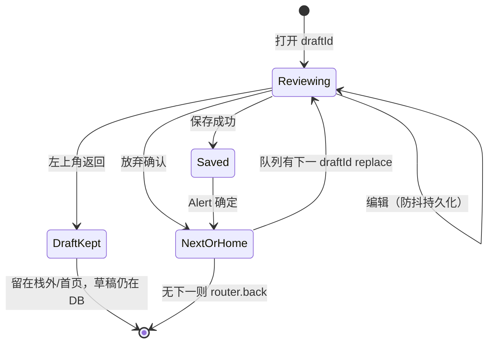

# Package A：核心流程稳定化报告

## 1. 改动文件一览

| 文件 | 作用 |
|------|------|
| `lib/devToolsAccess.ts` | **新增**：`DEV_TOOLS_ENABLED_KEY` 与 `isDevToolsUnlocked()`，供审核页、复盘页与设置共用。 |
| `app/(tabs)/settings.tsx` | 设置页从 `devToolsAccess` 引用密钥；连点次数 **5→7**；底部版本/debug 文案仅在 **`__DEV__` 或已解锁 Dev Tools** 时显示。 |
| `app/review-retrospective.tsx` | 进入页时校验 `isDevToolsUnlocked()`；未解锁则提示并返回，**不加载**复盘数据、不暴露 JSON 流程。 |
| `app/scan-review/[draftId].tsx` | 草稿加载 **竞态取消**；**650ms 防抖 + 卸载/离开强制 flush**；保存前 **flush**；`goNextOrBack` **容错 + 队列失败回退**；学习/增长分析 **try/catch + logger.warn**；**trace 仅开发者可见**；区块标题区分「编辑 / 识别参考」；空商品行提示；顶栏与保存区 **流程说明文案**。 |
| `app/(tabs)/index.tsx` | 选图结果 **0 张** 时友好 Alert；多张 **全部失败** 时再次 **`clearScanReviewQueue`**，避免残留脏队列。 |
| `locales/en.json` / `zh.json` / `ja.json` | `devTools.*`、`home.scan.noImages`、`scanReview.flowHint` 等文案。 |

未改：OCR、分类体系、订阅、Tab 菜单结构；未删除任何 Dev 能力，仅 **收口入口与可见性**。

---

## 2. 各改动解决的问题

- **防抖丢编辑**：离开审核页（返回、系统杀进程前卸载）若在 650ms 内，原先可能未落库；现通过 **`persistPayloadRef` + 卸载 flush** 与 **保存前 flush** 降低丢失概率。
- **草稿加载竞态**：快速切换 `draftId` 时旧请求晚到可能覆盖新草稿；现用 **`cancelled` 标志** 忽略过时结果，减轻字段闪烁/覆盖。
- **队列/删除一致性**：`removeScanReviewDraft` 或 `peekNextDraftId` 异常时避免卡死；**logger.warn** 并 **`router.back()`**；全批失败时 **清空队列**。
- **学习/增长静默失败**：保存主路径成功后，学习或增长分析失败 **不再阻断已落库**，但 **`logger.warn`** 便于排查。
- **普通用户看到 trace / 复盘**：trace 依赖 **与设置相同的 Dev 解锁标志**；复盘页 **硬门禁**，深链也无法在无解锁下使用。
- **设置页暴露内部状态**：生产用户不再看到 `devToolsEnabled` / build 调试脚注（除非已解锁或 `__DEV__`）。
- **选图 0 张**：静默返回改为 **明确提示**，避免「点了没反应」的困惑。

---

## 3. 主流程行为定义（当前实现）

1. **首页选图/拍照** → 确认 → 单张：`clearScanReviewQueue` → `setScanReviewQueue([draftId])` → `push` 审核页；多张：逐张 `runScanPipelineToReview`，成功的 `draftId` 入队 → `setScanReviewQueue` → 打开队首。
2. **审核页**：从 `scan_review_draft` 读快照 + 可选 `editor_state_json`；编辑防抖写入 SQLite；**返回**不删草稿；**放弃**确认后删草稿并 **peekNext**；**保存**写 `receipts`（`recognition_snapshot_json` + `analysis_json` 含 `review_meta`），再学习/增长（失败仅日志），再删草稿并 **peekNext**。
3. **识别快照**：`saveReceipt(..., recognitionSnapshot: draft.recognitionSnapshot)` → DB **`recognition_snapshot_json`** 为建草稿时的识别结构（与人工结果分离）。
4. **人工结果**：`analysis_json` 含用户改过的 merchant/date/total/items 及 **`review_meta`**（`error_tags`、`trace_id`、`saved_at`）；商品行含 **`ocr_recognized_name`** 与 **`name`**；**`user_edited = 1`**（`saveReceipt` 的 `reviewedSave` 分支）。

---

## 4. 状态机：返回 / 放弃 / 保存 / 下一张

- **返回**：仅导航返回，**不** `removeScanReviewDraft`；卸载时 **flush** 编辑态。
- **放弃**：`removeScanReviewDraft` → `peekNextDraftId`（从队列移除当前 id，过滤已删 id）→ 有下一则 **replace** 到下一张审核路由，否则 **back**。
- **保存**：DB 插入 receipt → 学习 / 增长（失败日志）→ 与放弃相同的 **出队 + 下一张 / 返回**。

---

## 5. 开发态与用户态隔离

| 能力 | 普通用户 | 开发者（设置内连点版本约 7 次解锁） |
|------|-----------|--------------------------------------|
| 审核页 `trace_id` | 隐藏 | 显示 |
| 设置内 Dev Tools 区块 | 隐藏 | 显示（含复盘入口等） |
| `/review-retrospective` | 进入时被拦截并提示 | 正常使用（含 JSON 导出/分享） |
| 设置底部 `currentVersion` / `devToolsEnabled` 脚注 | 隐藏 | 显示（`__DEV__` 构建下始终可显示脚注） |

持久化键：`lib/devToolsAccess.ts` 中的 **`DEV_TOOLS_ENABLED_KEY`**，与设置页写入一致。

---

## 6. 已知限制（未在本次扩大范围）

- **冷启动自动回到审核队列**：仍依赖用户从首页再次进入扫描/历史；未做「未完成队列」的全局横幅或自动跳转。
- **硬件返回键**：与左上角返回一致依赖系统导航；未单独拦截 Android `BackHandler` 做二次确认。
- **多张队列与「仅部分成功」**：队列为成功草稿；失败张仅摘要 Alert，需用户自行重扫失败图。
- **`user_items_json`**：审核保存路径仍以 **`analysis_json.items`** 为主；与历史详情编辑路径的 DB 字段分工保持现状，未做双写合并。

---

## 7. 自检清单（Package A）

- [ ] **单张扫描**：确认 → 进入审核 → 保存 → 回首页/历史可见新小票。
- [ ] **多张扫描**：多张确认 → 第一张审核 → 保存 → 自动第二张；最后一张保存后返回。
- [ ] **保存推进**：保存成功 Alert 点确定后进入下一张或退出审核栈。
- [ ] **放弃推进**：放弃确认后当前草稿删除，有下一张则进入下一张。
- [ ] **返回保留草稿**：审核中点返回，再从相同 `draftId` 进入（或依赖 DB 的 editor_state）内容仍在。
- [ ] **草稿冷启动恢复**：编辑后杀进程重启，打开同一 `scan-review/[draftId]`，编辑应接近杀进程前（依赖卸载 flush + 防抖）。
- [ ] **队列脏数据**：模拟全批识别失败，不应残留阻塞；部分成功时队列仅含成功 id。
- [ ] **Dev Tools 隐藏**：未解锁时设置页无 Dev 区块、无底部 debug 脚注。
- [ ] **普通用户路径不暴露调试**：未解锁时审核页无 trace；直接打开复盘 URL 被拦截。
- [ ] **选图 0 张**：有文案提示，扫描状态结束。

---

## 8. 测试

本地执行：`npm test`（Jest）应在改动后通过；若有与路由/AsyncStorage 相关的单测缺口，以手工走查上述清单为准。
